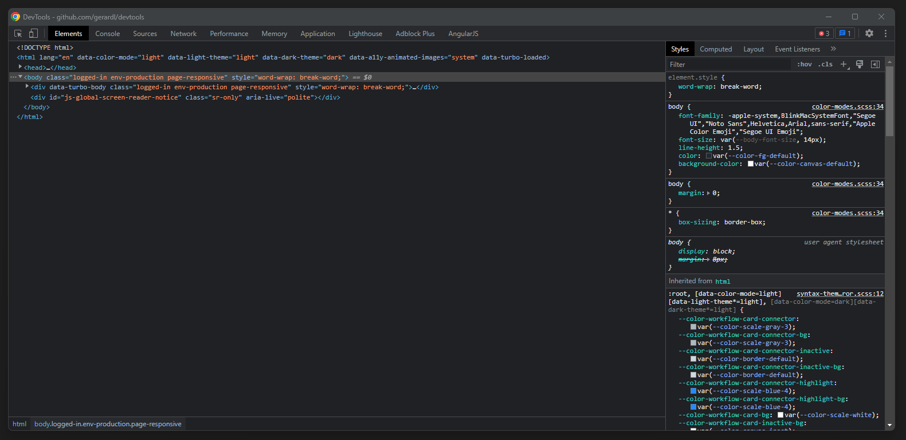
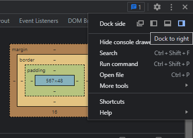
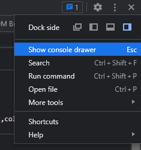
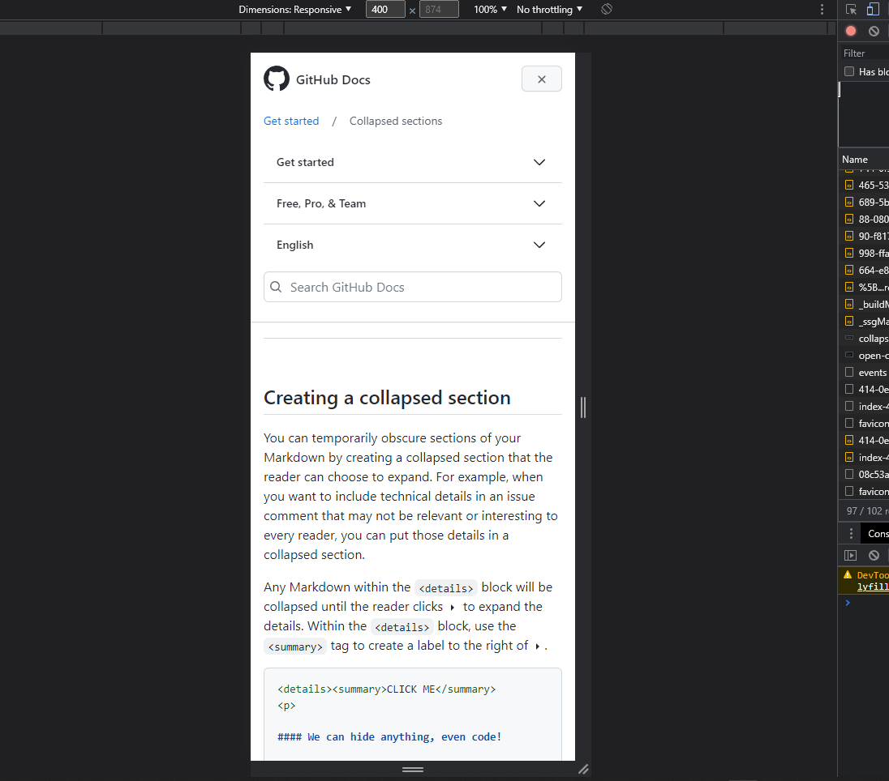
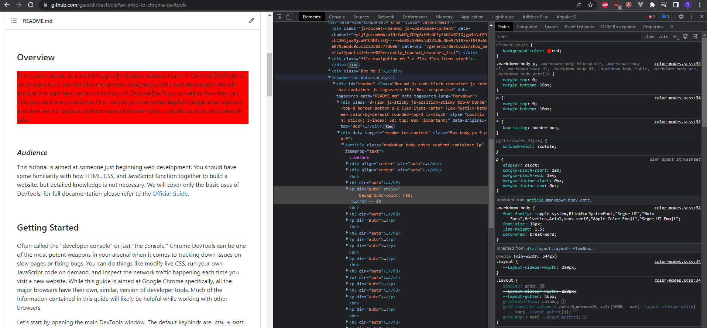
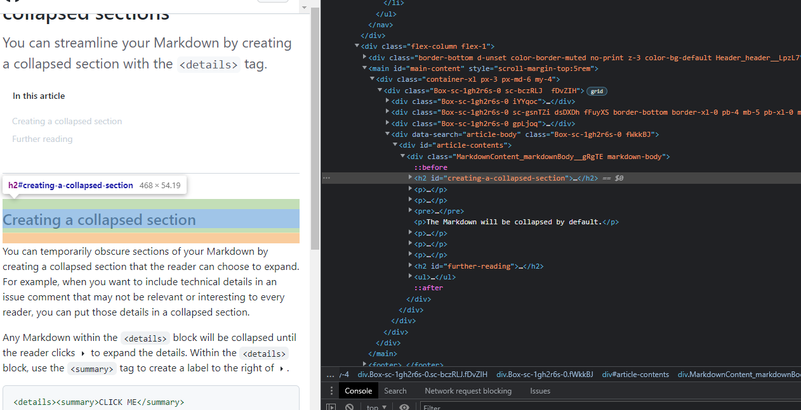
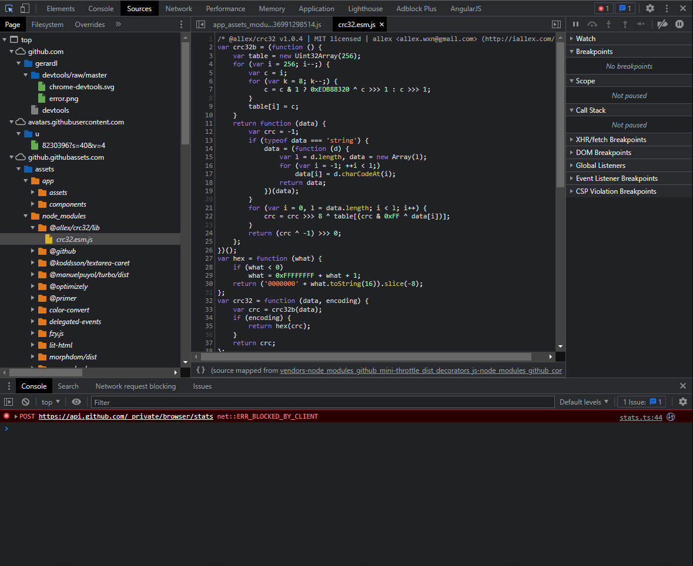

<div align="center">


# An Intro to Chrome DevTools
### By Gerard Lucas

<br />

</div>

<div align="center">

[Overview](#overview) • 
[Getting Started](#getting-started) • 
[Customization](#customization) • 
[Elements](#elements) • 
[Console](#console) • 
[Sources](#sources) • 
[Network](#network)

</div>

<br />

## Overview

This tutorial serves as a walkthrough of the basic features found in Chrome DevTools--a set of tools built into the Chrome browser designed to help web developers.
We will explore the main features and functions of Chrome DevTools, as well as how they can help you be more productive. First, we will go over some helpful configuration options, and then we will explore common uses of the elements, console, sources, and network tabs.  

### *Audience*

This tutorial is aimed at someone just beginning web development. You should have some familiarity with how HTML, CSS, and JavaScript function together to build a website, but detailed knowledge is not necessary. We will cover only the basic uses of DevTools; for full documentation please refer to the [Official Guide](https://developer.chrome.com/docs/devtools/).

<br/>

## Getting Started

Often called the "developer console" or just "the console," Chrome DevTools can be one of the most potent weapons in your arsenal when it comes to tracking down issues on slow pages or fixing bugs. You can do things like modify live CSS, run your own JavaScript code on demand, and inspect the network traffic happening each time you visit a new website. While this guide is aimed at Google Chrome specifically, all the major browsers have their own, similar, version of developer tools. Much of the information contained in this guide will likely be helpful while working with other browsers.  

The only software you need is the Google Chrome browser; DevTools is included in every install. Let's start by opening the main DevTools window. The default keybinds are <kbd>CTRL</kbd>+<kbd>SHIFT</kbd>+<kbd>I</kbd> and <kbd>F12</kbd>. If you have changed these shortcuts, you can also click on the customization menu (three dots) in the top-right corner of Google Chrome, open the **more tools** sub-menu and click **Developer tools**. You should see a window that looks something like the image below.

<br />



<br />

## Customization

Just as you have a prefered way of setting up your IDE, you will probably have a way you like to set up your DevTools windows. Much of this is personal preference, but we will go over a few common modifications that can help boost your speed while using the tools.

### *Dock the Window*

By default, the DevTools application will open up in its' own window, but it is possible to keep it docked in your main Chrome browser tab right next to the website you are currently modifying. This can be especially helpful when you only have one monitor, or when you are using on your monitors for development work and one for your Chrome tab. To do this, open the customization menu (three dots in the top right corner) and select one of the dock locations. You can return to a seperate window by selecting the first option in the menu.

<br />



<br />

### *Keep Console Open*

While the console is its' own section of DevTools with a dedicated tab, it is often helpful to have the console accessible no matter which part of DevTools you are currently using. This can also be done from the customization menu, or toggled on & off by the <kbd>ESC</kbd> key.

<br />



<br />

### *Mobile Mode*

Often when you are developing a website you need to test the user experience on cell phones and tablets. This is when mobile mode comes in handy. The blue button in the top right of the image below brings up the mobile menu, which allows you to pick from a list of specific devies to emulate and even an option to throttle your network speed to better mimic mobile network speeds. Mouse interactions change to mimic the touch controls and events found on phones and tables.

<br />



<br />


## Elements

The elements tab is probably the most used section of DevTools. Elements allows you to select, view, and modify the [DOM](https://en.wikipedia.org/wiki/Document_Object_Model) elements of the website you are currently viewing. Often, one of the most time consuming tasks of web development is making minor CSS tweaks, and this is when elements can be a real life saver. As you can see below, I've decided that I *need* to have a bright red background on my page, so I've selected the element in the DOM explorer window and modified the background-color style in the Styles pane to the right. Now I can see how my changes will look instantly, without having to redeploy my website (spoiler: not great).

<br />



<br />

### *Element Highlighting*

The DOM of a typical website can be absolutely massive, so one of the most helpful features of the elements tab is the ability to click on a section of the page and jump right to the HTML that created it. Not only that, but DevTools highlights the selected element, like in the image below, and even shows you padding and margins around it--represented by the green and orange boxes, respectively. right click an element on the page -> click inspect element -> elements tab opens focused to this element

<br />



<br />

## Console

If you don't have the console drawer open, you can get to it by typing ctrl+shift+j or it is the second tab after hitting F12.  

The two main functions of the console are to view logged messages from developers and to run JavaScript code.  

### *Viewing Messages*

When writing JavaScript, it can often be very useful to write messages from your code that you can view while you test out your website. 
Some of the most common are sending out a message when you reach a certain block of code, or print out the value of a variable. These messages are written by telling the console to log, like the example below.

``` js
console.log("Hello World!");
```

If you monitor the console while browsing popular websites, especially if you have ad-blockers on, you will see many error messages appear in the console. The image below shows a console exception, denoted by the red background and "X". The error message and location of the error is also displayed, in this case, a request to get data is being blocked by an ad-blocker. Clicking
the link to the right (www-embed-player) would navigate the user to a view of the offending code, giving them insight into the problem. This can be a great tool in figuring out where your own errors are originating from.

<br />


<br />

### *Writing JavaScript*

In addition to monitoring for messages coming from JavaScript code, you can also write your own code in the console. The console is something called a [REPL](https://en.wikipedia.org/wiki/Read%E2%80%93eval%E2%80%93print_loop)--A read-eval-print loop shell. This type of programming environment waits for one single group of user input, JavaScript code in this case, and then executes it and returns the result immediately. It functions similarly to the command prompt or terminal in your operating system. Open your console and execute the code below.

``` js
let name = "Friend";
let date = new Date();

console.log(`Hello ${name}! The date is ${date.toLocaleDateString()}.`);
```

As you can see, not only can you write messages, but you can create new variables, make use of built-in methods, and even modify the contents of the page you are viewing through console entry.

<br />

## Sources

The sources tab handles three very important functions:

1. It allows you to view all the files the current website has downloaded
2. Allows you to make changes to JavaScript and CSS files and view the results in your browser
3. And maybe most importantly, it allows you to debug code

<br />



<br />


### *Code Snippets*

An interesting and little known feature of the sources tab are code snippets. Code snippets allow you to save reusable code blocks that are stored in the sources tab. If you find yourself running the same JavaScript in the console over and over again, you may want to check out snippets. You can read more about them [Here](https://developer.chrome.com/docs/devtools/javascript/snippets/).


<br />

## Network

is tutorial serves as an introduction and walkthrough of the basic features
found in the Google Chrome Developer Console. We will discuss how it can be helpful for 
We will explo


<br/>
<br/>
<br/>

*This guide was created by [Gerard Lucas](https://gerardlucas.com) for IT1600-01 @ The University of Missouri-Columbia*

<br />

[Back to Top](#an-intro-to-chrome-devtools)
