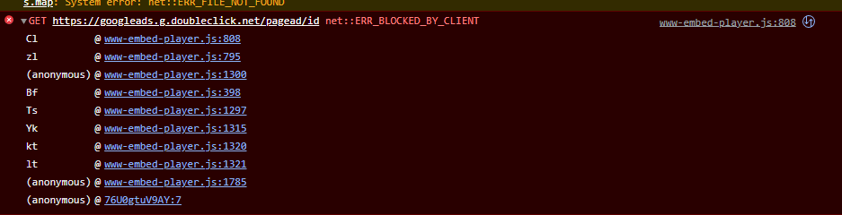

<div align="center">


# An Intro to Chrome DevTools
### By Gerard Lucas

<br />

</div>

<div align="center">

[Overview](#overview) • 
[Getting Started](#getting-started) • 
[Elements Tab](#elements) • 
[Console](#console) • 
[Sources Tab](#sources) • 
[Network Tab](#network)

</div>

## Overview

This tutorial serves as a walkthrough of the basic features found in Chrome DevTools--a set of tools built into the Chrome browser designed to help web developers.
We will explore the main features and functions of Chrome DevTools, as well as how they can help you be more productive. First, we will go over some helpful configuration options, and then we will explore common uses of the elements, console, sources, and network tabs.

<br/>

### *Audience*

This tutorial is aimed at someone just beginning web development. You should have some familiarity with how HTML, CSS, and JavaScript function together to build a website, but detailed knowledge is not necessary. We will cover only the basic uses of DevTools; for full documentation please refer to the [Official Guide](https://developer.chrome.com/docs/devtools/).

<br/>

## Getting Started

Often called the "dev console" or just "the console," Chrome DevTools can be one of the most potent weapons in your arsenal when it comes to tracking down issues on slow pages or fixing bugs. You can do things like modify live CSS, run your own JavaScript code on demand, and inspect the network traffic happening each time you visit a new website. While this guide is aimed at Google Chrome specifically, all the major browsers have their own, similar, version of developer tools. Much of the information contained in this guide will likely be helpful while working with other browsers.  

opening the console

Just as you have a prefered way of setting up your IDE, you will probably have a way you like to set up your console.

a note that firefox and edge both have consoles also.

pin to right

keep console open (esc hotkey)

lots more to see in "more tools"

<br />

## Elements

is tutorial serves as an introduction and walkthrough of the basic features
found in the Google Chrome Developer Console. We will discuss how it can be helpful for 
We will explo

right click an element on the page -> click inspect element -> elements tab opens focused to this element

<br />

## Console

If you don't have the console drawer open, you can get to it by typing ctrl+shift+j or it is the second tab after hitting F12.  

The two main functions of the console are to view logged messages from developers and to run JavaScript code.  

### *Viewing Messages*

When writing JavaScript, it can often be very useful to write messages from your code that you can view while you test out your website. 
Some of the most common are sending out a message when you reach a certain block of code, or print out the value of a variable. These messages are written by telling the console to log, like the example below.

``` js
console.log("Hello World!");
```

If you monitor the console while browsing popular websites, especially if you have ad-blockers on, you will see many error messages appear in the console. The image below shows a console exception, denoted by the red background and "X". The error message and location of the error is also displayed, in this case, a request to get data is being blocked by an ad-blocker. Clicking
the link to the right (www-embed-player) would navigate the user to a view of the offending code, giving them insight into the problem. This can be a great tool in figuring out where your own errors are originating from.

<br />



<br />

### *Writing JavaScript*

In addition to monitoring for messages coming from JavaScript code, you can also write your own code in the console. The console is something called a [REPL](https://en.wikipedia.org/wiki/Read%E2%80%93eval%E2%80%93print_loop)--A read-eval-print loop shell. This type of programming environment waits for one single group of user input, JavaScript code in this case, and then executes it and returns the result immediately. It functions similarly to the command prompt or terminal in your operating system. Open your console and execute the code below.

``` js
let name = "Friend";
let date = new Date();

console.log(`Hello ${name}! The date is ${date.toLocaleDateString()}.`);
```

As you can see, not only can you write messages, but you can create new variables, make use of built-in methods, and even modify the contents of the page you are viewing through console entry.

<br />

## Sources

is tutorial serves as an introduction and walkthrough of the basic features
found in the Google Chrome Developer Console. We will discuss how it can be helpful for 
We will explo


code snippets - save reusable javascript blocks that are stored in the sources tab.

https://developer.chrome.com/docs/devtools/javascript/snippets/

<br />

## Network

is tutorial serves as an introduction and walkthrough of the basic features
found in the Google Chrome Developer Console. We will discuss how it can be helpful for 
We will explo


<br/>
<br/>
<br/>

*This guide was created by [Gerard Lucas](https://gerardlucas.com) for IT1600-01 @ The University of Missouri-Columbia*

<br />

[Back to Top](#an-intro-to-chrome-devtools)
